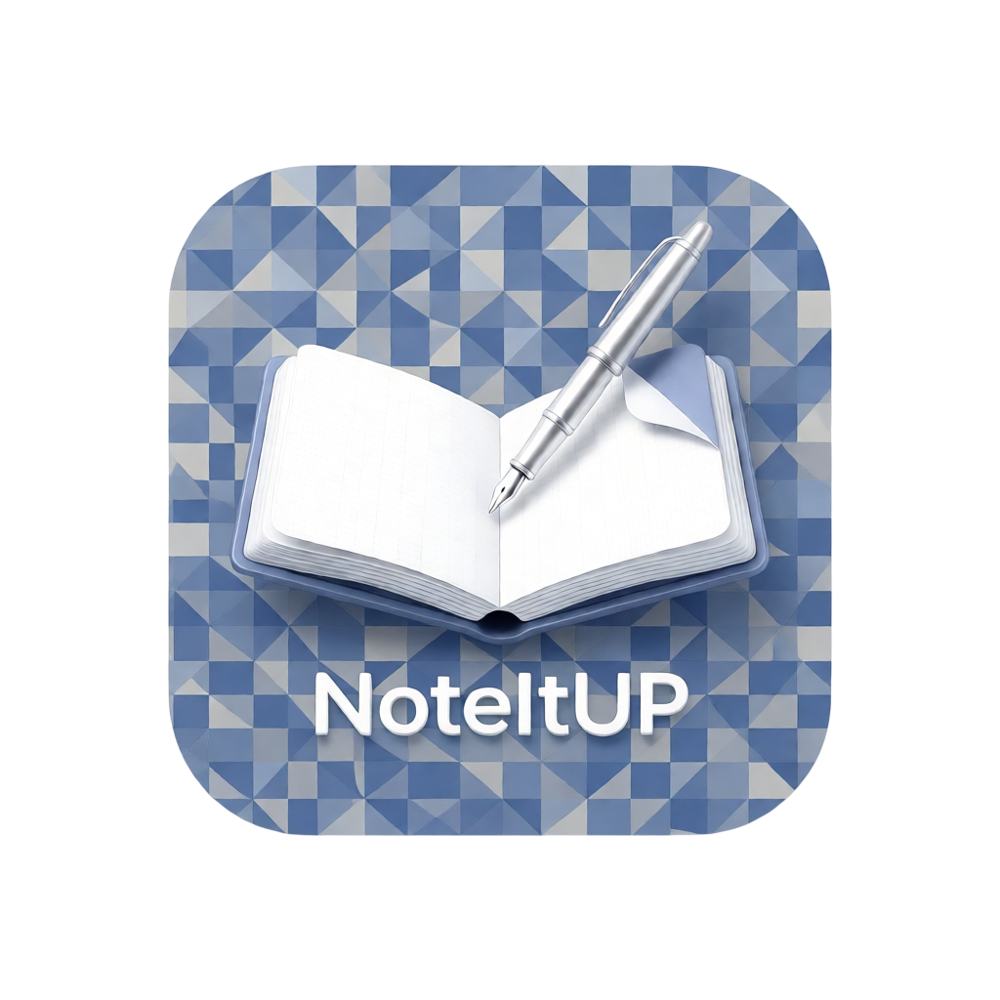
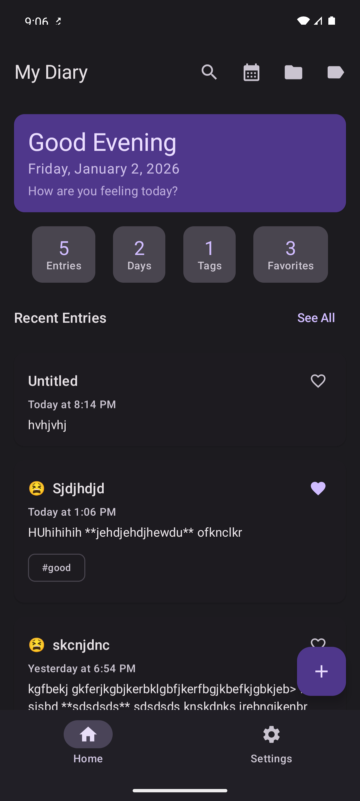
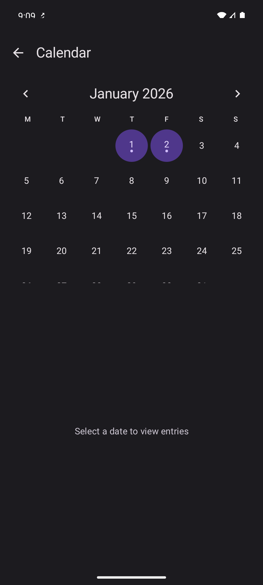
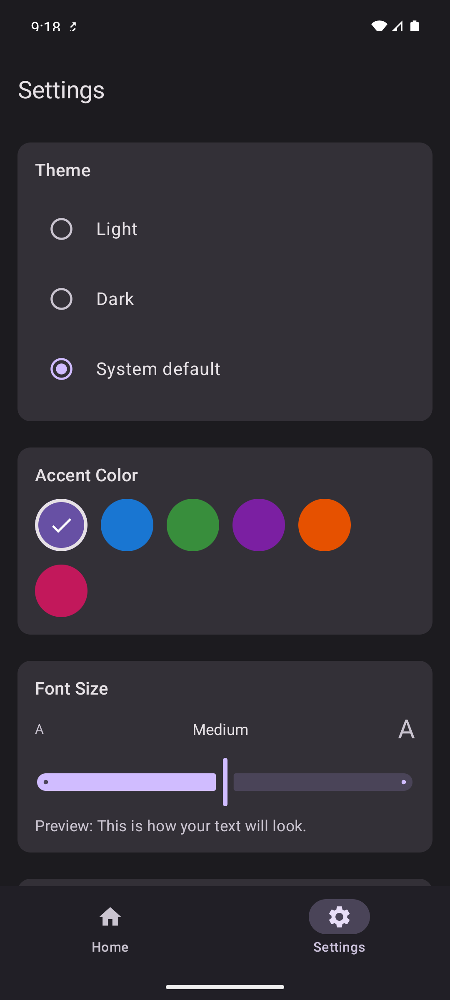

<p align="center">
  
</p>

# NoteItUP - Personal Diary App

A modern, feature-rich personal diary application built with **Kotlin Multiplatform** and **Compose Multiplatform**, targeting Android, iOS, and Desktop (JVM).

## Screenshots

<p align="center">
  
  
  
  
</p>

## Features

### Core Features
- **Rich Text Editor** - Write diary entries with Markdown support
  - Bold, Italic, Headers (H1, H2)
  - Bullet lists, Numbered lists
  - Blockquotes, Code blocks, Links
  - Live preview mode

- **Mood Tracking** - Track your emotional state with mood indicators
  - Amazing, Good, Neutral, Sad, Terrible moods
  - Visual mood emojis on entries

- **Organization**
  - **Folders** - Organize entries into custom folders with colors
  - **Tags** - Add multiple tags to entries for easy filtering
  - **Favorites** - Mark important entries as favorites

### Advanced Features
- **Image Attachments** - Attach photos to diary entries
  - Pick from gallery or capture with camera
  - Automatic image compression (max 1920px, JPEG 85%)
  - Thumbnail previews

- **Location Tagging** - Add GPS coordinates to entries
  - Automatic reverse geocoding for address display
  - Location permission handling

- **Calendar View** - Browse entries by date
  - Visual indicators for days with entries
  - Quick navigation to specific dates

- **Search** - Full-text search across all entries

- **Statistics Dashboard**
  - Total entries count
  - Writing streak tracking
  - Mood distribution
  - Tags and favorites count

### Security
- **PIN Protection** - Lock app with 4-digit PIN
- **Biometric Authentication** - Fingerprint/Face unlock support

### Data Management
- **Export/Import** - Backup and restore entries (JSON format)
- **Cloud Sync** - Backup to cloud providers
  - Dropbox integration (available)
  - Google Drive (coming soon)
  - Auto-sync with configurable intervals

## Tech Stack

- **Kotlin Multiplatform** - Shared business logic across platforms
- **Compose Multiplatform** - Shared UI across Android, iOS, Desktop
- **SQLDelight** - Type-safe SQL with multiplatform support
- **Koin** - Dependency injection
- **Kotlin Coroutines & Flow** - Asynchronous programming
- **Material Design 3** - Modern UI components

## Project Structure

```
composeApp/src/
├── commonMain/          # Shared code for all platforms
│   ├── kotlin/
│   │   ├── data/        # Repository implementations, database
│   │   ├── domain/      # Models, use cases, repository interfaces
│   │   └── presentation/# Screens, ViewModels, UI components
│   └── sqldelight/      # Database schema and queries
├── androidMain/         # Android-specific implementations
├── iosMain/             # iOS-specific implementations
└── jvmMain/             # Desktop-specific implementations
```

## Building the Project

### Prerequisites
- Android Studio Hedgehog or later
- JDK 17+
- Xcode 15+ (for iOS)

### Android
```shell
# Debug build
./gradlew :composeApp:assembleDebug

# Install on connected device
./gradlew :composeApp:installDebug
```

### Desktop (JVM)
```shell
./gradlew :composeApp:run
```

### iOS
Open `/iosApp` in Xcode and run, or use:
```shell
./gradlew :composeApp:iosSimulatorArm64Main
```

## Architecture

The app follows **Clean Architecture** with **MVI (Model-View-Intent)** pattern:

- **Domain Layer** - Business logic, models, use cases
- **Data Layer** - Repository implementations, local database, platform services
- **Presentation Layer** - Compose UI, ViewModels, UI state management

### Key Patterns
- `expect/actual` for platform-specific implementations
- Unidirectional data flow with StateFlow
- Repository pattern for data access

## Cloud Sync Setup

### Dropbox Setup
1. Create an app at [Dropbox App Console](https://www.dropbox.com/developers/apps)
2. Choose "Scoped access" and "App folder"
3. In Permissions tab, enable `files.content.write` and `files.content.read`
4. In Settings tab, add OAuth2 Redirect URI: `com.romreviewertools.noteitup://oauth2callback`
5. Copy `ApiKeys.kt.template` to `ApiKeys.kt` and add your App Key and Secret

### Google Drive Setup (Coming Soon)
Instructions will be added when Google Drive integration is enabled.

## Contributing

Contributions are welcome! Please feel free to submit a Pull Request.

## License

This project is licensed under the MIT License - see the LICENSE file for details.

---

Built with Kotlin Multiplatform & Compose Multiplatform
