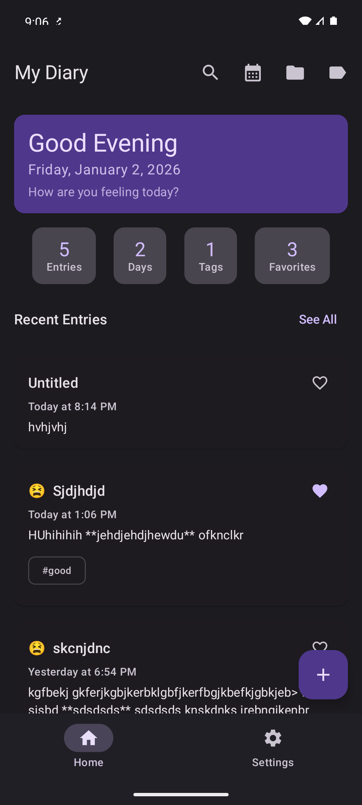
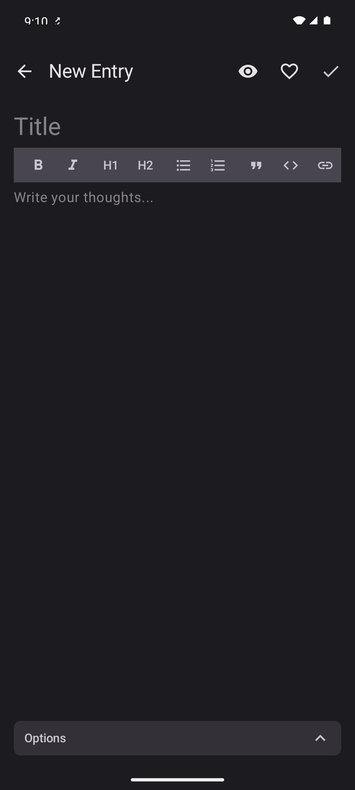
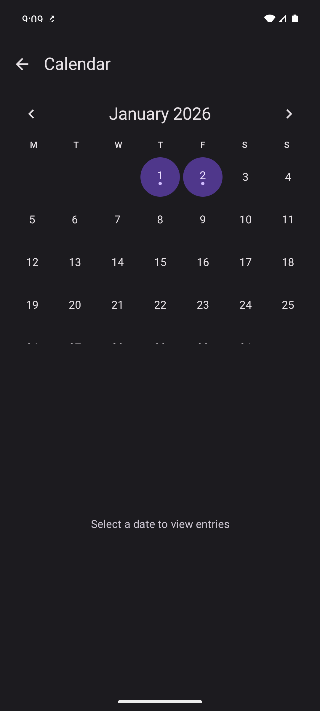

<p align="center">
  
</p>

<h1 align="center">NoteItUP</h1>

<p align="center">
  <strong>AI-Powered Personal Diary & Journal</strong><br>
  Privacy-first journaling with intelligent writing assistance
</p>

<p align="center">
  <a href="https://play.google.com/store/apps/details?id=com.romreviewertools.noteitup">
    
  </a>
  <a href="https://github.com/romreviewer/NoteItUP">
    
  </a>
</p>

<p align="center">
  
  
  
  
</p>

---

## Overview

NoteItUP is a modern, open-source journaling application that combines the simplicity of traditional diary writing with the power of AI assistance. Built with **Kotlin Multiplatform** and **Compose Multiplatform**, it runs natively on Android, iOS, and Desktop while keeping your data secure and private.

**Key Highlights:**
- 🧠 **On-Device AI** - Gemma 4 runs entirely on your phone. No internet needed, no data leaves your device
- 🤖 **AI-Powered** - 8 writing improvement types + Brainstorm chat mode (local or cloud)
- 🔐 **Privacy-First** - All data stored locally, encrypted backups
- 📱 **Cross-Platform** - One codebase for Android, iOS & Desktop
- 🌟 **100% Open Source** - Transparent, community-driven development

## Screenshots

<p align="center">
  
  
  
  
</p>

## Features

### 🤖 AI Writing Assistant

Transform your journaling with intelligent AI assistance -- running **entirely on your device** or via cloud APIs.

#### 🧠 On-Device AI (NEW - Gemma 4)

**Your diary entries never leave your phone for AI processing.**

| Feature | Detail |
|---------|--------|
| **Model** | Google Gemma 4 E2B (2B parameters) |
| **Engine** | LiteRT-LM with GPU acceleration |
| **Privacy** | 100% on-device, works completely offline |
| **Setup** | One-time ~1.6GB download, auto-loads on first use |
| **Requirement** | Android/Desktop, 8GB+ RAM |
| **Import** | Already have the model? Select the file directly |

> No API key needed. No internet needed. No data shared. Just private AI.

#### Text Improvement (8 Types)
| Type | Description |
|------|-------------|
| 📝 **Improve for Journal** | Optimize entries for personal reflection |
| ✅ **Fix Grammar** | Correct spelling and grammar errors |
| 💡 **Improve Clarity** | Make thoughts clearer and organized |
| ✂️ **Make Shorter** | Condense while keeping key points |
| 📖 **Expand** | Add depth and detail to entries |
| 👔 **Professional Tone** | Convert to formal writing style |
| 😊 **Casual Tone** | Make it conversational and relaxed |
| 📋 **Summarize** | Create concise summaries |

#### 💬 Brainstorm Mode
- Interactive AI chat for creative writing
- Get writing prompts and ideas
- Overcome writer's block
- Conversational interface with persistent message history

#### Cloud AI Providers (BYOK)

Prefer cloud models? Bring your own API key:

| Provider | Free Tier | Models |
|----------|-----------|--------|
| **Groq** | ✅ Free & Fast | Llama 3.x |
| **Google Gemini** | ✅ 1,500 req/day | Gemini 2.0 Flash |
| **OpenRouter** | ✅ Some models | 100+ models |
| **Together AI** | $25 credit | Various |
| **OpenAI** | ❌ Paid | GPT-4o, GPT-4o-mini |
| **Anthropic** | ❌ Paid | Claude 3.5 Sonnet |

> **Privacy Note:** API keys are stored securely on-device. Journal content is only sent to your chosen cloud provider when you explicitly request improvements. For maximum privacy, use the local Gemma 4 option.

---

### ✍️ Rich Text Editor

Full **WYSIWYG editor** with formatting toolbar:

- **Text Formatting**: Bold, Italic, Underline, Strikethrough
- **Headings**: H1, H2, H3 levels
- **Lists**: Bullet lists, Numbered lists
- **Blocks**: Blockquotes, Code blocks
- **Links**: Inline hyperlinks
- **Live Preview**: Toggle between edit and preview modes

---

### 😊 Mood Tracking

Track your emotional journey:

- **5 Mood Levels**: Amazing, Good, Neutral, Sad, Terrible
- **Visual Indicators**: Emoji icons on entries
- **Statistics**: Mood distribution charts
- **Trends**: Track mood patterns over time

---

### 📁 Organization

Keep your journal organized:

- **Folders** - Custom folders with color coding
- **Tags** - Multiple tags per entry for flexible categorization
- **Favorites** - Star important entries for quick access
- **Calendar View** - Browse entries by date with visual indicators
- **Search** - Full-text search across all entries

---

### 📸 Media & Location

Enrich your entries:

- **Image Attachments**
  - Pick from gallery or capture with camera
  - Automatic compression (max 1920px, JPEG 85%)
  - Thumbnail previews in entries

- **Location Tagging**
  - GPS coordinates with your entries
  - Automatic address lookup (reverse geocoding)
  - Map integration

---

### 🔐 Security

Your privacy matters:

| Feature | Description |
|---------|-------------|
| **PIN Lock** | 4-6 digit PIN protection |
| **Biometric** | Fingerprint / Face ID unlock |
| **Auto-Lock** | Configurable timeout (immediate to 30 min) |
| **Encrypted Backups** | Password-protected cloud backups |
| **Local Storage** | All data stays on your device |

---

### ☁️ Cloud Sync

Secure backup to cloud providers:

- **Google Drive** - Full backup/restore support
- **Dropbox** - Full backup/restore support
- **End-to-End Encryption** - Backups encrypted with your password
- **Auto-Sync** - Configurable intervals (hourly, daily, weekly)
- **Wi-Fi Only** - Option to sync only on Wi-Fi

---

### 📤 Import & Export

Migrate from other apps or backup locally:

**Export Formats:**
- JSON (full backup with metadata)
- CSV (spreadsheet compatible)
- Markdown (plain text)
- PDF (formatted document)

**Import From:**
- NoteItUP backup (JSON)
- **Day One** - Full journal import with photos
- **Joplin** - Notes import (.jex files)

---

### 📊 Statistics Dashboard

Insights into your journaling:

- Total entries count
- Writing streak tracking
- Mood distribution pie chart
- Most used tags
- Entries per month/year
- Favorites count

---

### 🎨 Customization

Make it yours:

- **Themes**: Light, Dark, System default
- **Accent Colors**: Multiple color options
- **Font Sizes**: Small, Medium, Large, Extra Large
- **Daily Reminders**: Configurable notification time
- **Branded Splash Screen**: Purple branded launch screen (Android 12+ native API with backward compat)

---

## Platform Support

| Feature | Android | iOS | Desktop |
|---------|:-------:|:---:|:-------:|
| Rich Text Editor | ✅ | ✅ | ✅ |
| On-Device AI (Gemma 4) | ✅ GPU | ❌ | ✅ CPU |
| Cloud AI (BYOK) | ✅ | ✅ | ✅ |
| Brainstorm Chat | ✅ | ✅ | ✅ |
| Cloud Sync | ✅ | ✅ | ✅ |
| Import/Export | ✅ | ✅ | ✅ |
| Image Attachments | ✅ | ✅ | ✅ |
| Biometric Unlock | ✅ | ✅ | ❌ |
| Camera Capture | ✅ | ✅ | ❌ |
| GPS Location | ✅ | ✅ | ❌ |
| Daily Reminders | ✅ | ✅ | ❌ |
| In-App Review | ✅ | ❌ | ❌ |
| Multi-Window | ❌ | ❌ | ✅ |

---

## Tech Stack

| Technology | Purpose |
|------------|---------|
| **Kotlin Multiplatform** | Shared business logic |
| **Compose Multiplatform** | Shared UI across platforms |
| **SQLDelight** | Type-safe SQL database |
| **Koin** | Dependency injection |
| **Ktor Client** | HTTP client for APIs |
| **LiteRT-LM** | On-device LLM inference (Gemma 4) |
| **kotlinx.serialization** | JSON parsing |
| **Material Design 3** | Modern UI components |
| **Richeditor-compose** | WYSIWYG editor |
| **Firebase Analytics** | Usage analytics (Android) |
| **Play In-App Review** | Rating prompts (Android) |
| **AndroidX SplashScreen** | Branded launch screen (Android) |

---

## Getting Started

### Download

<a href="https://play.google.com/store/apps/details?id=com.romreviewertools.noteitup">
  
</a>

### Build from Source

**Prerequisites:**
- Android Studio Hedgehog or later
- JDK 17+
- Xcode 15+ (for iOS)

```bash
# Clone the repository
git clone https://github.com/romreviewer/NoteItUP.git
cd NoteItUP

# Android
./gradlew :composeApp:assembleDebug
./gradlew :composeApp:installDebug

# Desktop
./gradlew :composeApp:run

# iOS - Open in Xcode
open iosApp/iosApp.xcodeproj
```

---

## AI Setup Guide

### Recommended: Local AI (Gemma 4) -- No API Key Needed

The easiest and most private option. Everything runs on your device.

1. Open any diary entry and tap an AI improvement chip
2. The model downloads automatically (~1.6 GB, one-time)
3. AI loads on first use -- just wait ~5-10 seconds
4. Done! All future AI features work instantly, even offline

**Already have the model file?** Go to **Settings -> AI Settings -> Select File** to import it.

**Requirements:** Android or Desktop, 8GB+ RAM

### Alternative: Cloud AI Providers

If you prefer cloud-based models, bring your own API key:

1. Go to **Settings -> AI Settings**
2. Select a cloud provider
3. Enter your API key
4. Tap **Test Connection** to verify

| Provider | Get API Key | Notes |
|----------|-------------|-------|
| Groq | [console.groq.com](https://console.groq.com/keys) | Free & fast |
| Google Gemini | [aistudio.google.com](https://aistudio.google.com/apikey) | Free: 1,500 req/day |
| OpenAI | [platform.openai.com](https://platform.openai.com/api-keys) | Paid: ~$0.15-5/M tokens |
| Anthropic | [console.anthropic.com](https://console.anthropic.com/settings/keys) | Paid: ~$3-15/M tokens |
| OpenRouter | [openrouter.ai](https://openrouter.ai/keys) | Some free models |
| Together AI | [api.together.xyz](https://api.together.xyz/settings/api-keys) | $25 free credit |

---

## Architecture

The app follows **Clean Architecture** with **MVI** pattern:

```
composeApp/src/
├── commonMain/          # Shared code (95%+)
│   ├── data/            # Repositories, database, APIs
│   ├── domain/          # Models, use cases
│   └── presentation/    # Screens, ViewModels, UI
├── androidMain/         # Android-specific
├── iosMain/             # iOS-specific
└── jvmMain/             # Desktop-specific
```

**Key Patterns:**
- `expect/actual` for platform-specific code
- Unidirectional data flow with StateFlow
- Repository pattern for data access
- Dependency injection with Koin

---

## Contributing

Contributions are welcome! Here's how you can help:

1. **Fork** the repository
2. **Create** a feature branch (`git checkout -b feature/amazing-feature`)
3. **Commit** your changes (`git commit -m 'Add amazing feature'`)
4. **Push** to the branch (`git push origin feature/amazing-feature`)
5. **Open** a Pull Request

### Ideas for Contributions
- 🌐 Translations to other languages
- 🎨 New themes and color schemes
- 🐛 Bug fixes and performance improvements
- 📝 Documentation improvements
- ✨ New features

---

## License

This project is licensed under the **MIT License** - see the [LICENSE](LICENSE) file for details.

---

## Support

- ⭐ **Star** this repo if you find it useful
- 🐛 **Report bugs** via [GitHub Issues](https://github.com/romreviewer/NoteItUP/issues)
- 💡 **Request features** via [GitHub Discussions](https://github.com/romreviewer/NoteItUP/discussions)
- 📧 **Contact**: Open an issue for questions

---

<p align="center">
  Built with ❤️ using Kotlin Multiplatform & Compose Multiplatform
</p>

<p align="center">
  <a href="https://github.com/romreviewer/NoteItUP">
    
  </a>
</p>